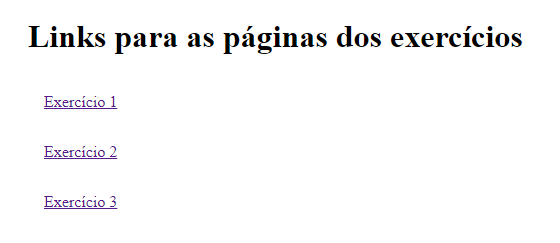
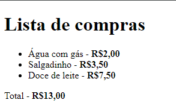
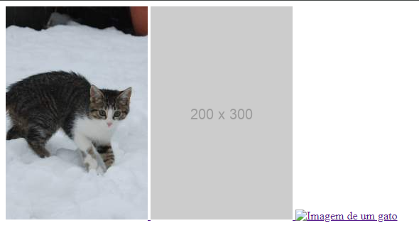
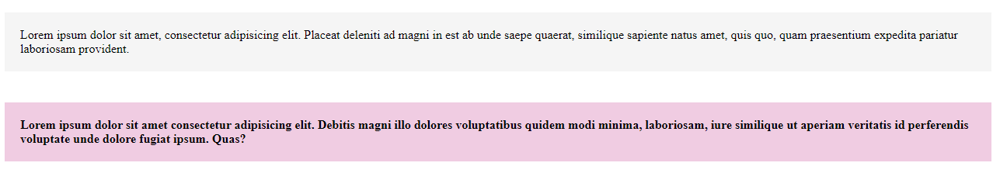

# Exercícios de HMTL e CSS Básico
Este repositório contém exercícios de HTML e CSS básico. Na página inicial estão os links para os três exercícios feitos.

[]

## Tecnologias utilizadas
- HTML; 
- CSS.

## Exercício 1
Nesse exercício foi desenvolvida uma lista de compras, feita com as tags "ul" e "li".

[]

## Exercício 2
Nesse exercício foram desenvolvidas imagens que contém um link e levam a outro site (no caso o google.com), utilizando tags "a" para criar um tipo de botão que leva a outro site, e a "img" que vai colocar uma imagem nesse botão.

Fiz de três maneiras diferentes, a primeira usando uma imagem nos arquivos do projeto, a segunda usando o placeholder e a terceira com o placekitten. (Observação: o placekitten parece estar instável de alguma maneira, as vezes a terceira imagem não carrega, assim como o site oficial também está demorando de carregar.)

[]

## Exercício 3
Nesse exercício foram desenvolvidos parágrafos que contém uma class cada um, sendo o debaixo destacado com negrito na fonte usando "font-weight: bolder;" na classe utilizada, os dois tem backgrounds distintos.

[]